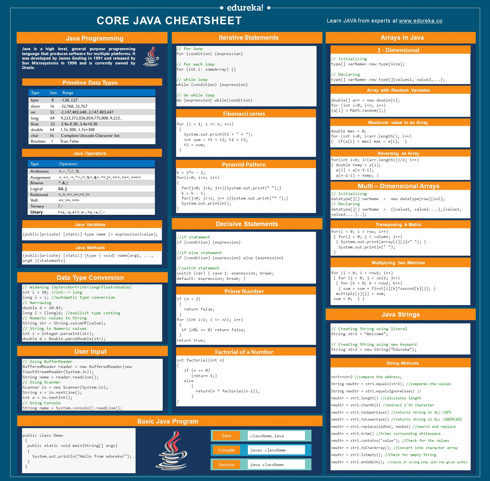
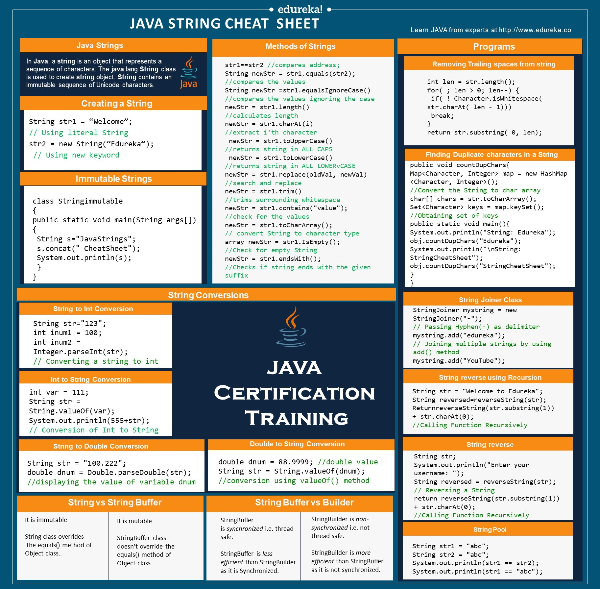

####Syntax Encompassing Documentation






How to read a file through main:

```
	File fileReceived = new File(args[0]);
	//Initialize scanner
    Scanner sc = null;
    //Try to create scanner that contains parameters, ie passing in, fileReceived 
    		//catch FileNotFoundException errors in the process
    try {
        sc = new Scanner(fileReceived);
    } catch (FileNotFoundException e) {
    }
	//Loop that will iteratively read the file until it does not contain a subsequent line
    while (sc.hasNextLine()) {
    	//Grab individual line of the file as String Data Type
    		String dataonfile = sc.next();
    		//Convert line string data(dataonfile) to integer for the ability to add to the class variable integerset
    			Integer dataConversion = Integer.parseInt(dataonfile);
    			//call setter method to add to the array
        		instancecounter.setarraylist(dataConversion);
    }


```

Static or Public:

The meaning of Encapsulation, is to make sure that "sensitive" data is hidden from users. To achieve this, you must:

    declare class variables/attributes as private
    
    provide public get and set methods to access and update the value of a private variable
    
You learned from the previous chapter that private variables can only be accessed within the same class (an outside class has no access to it). However, it is possible to access them if we provide public get and set methods.